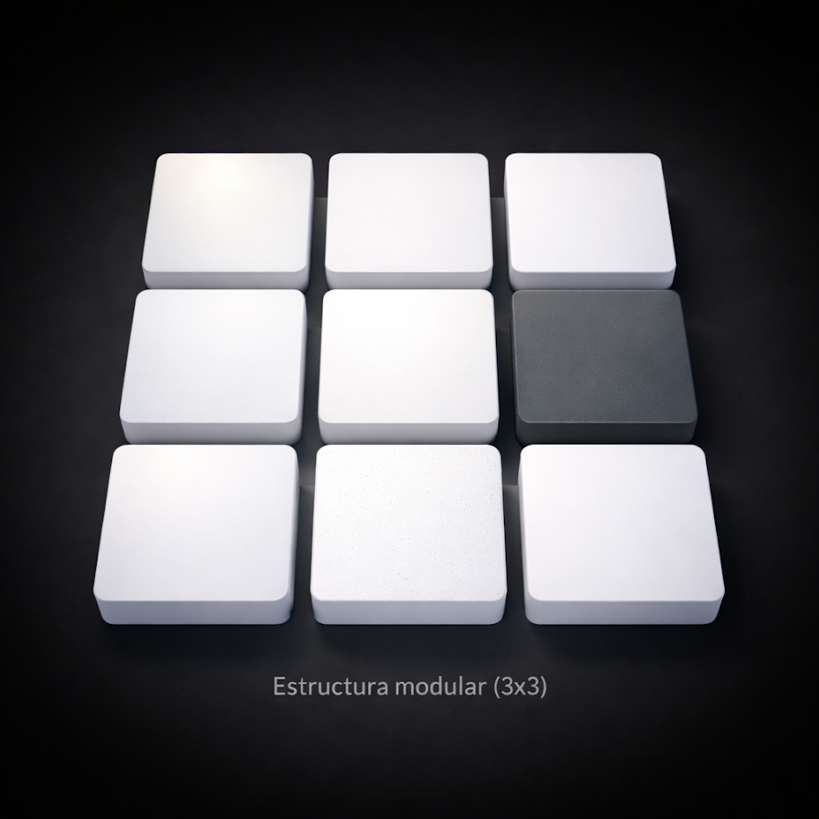
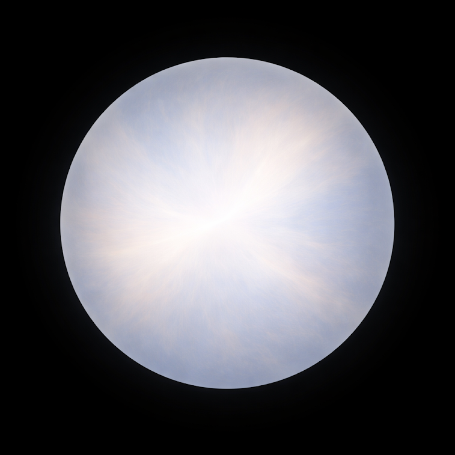

# WUOM — Universal Operating Model

👉 https://wuom.carrd.co

WUOM (Universal Operating Model) is a structural system designed to organize information, processes, and perception in complex environments.

It provides a clear framework to work with complexity through visual and operational geometries.

---

## What is WUOM

WUOM is not:
- an application 
- a productivity tool 
- a closed methodology 

WUOM is:
- a structural model 
- a visual-operational framework 
- a system to think, organize and act 

---

## Core Idea

WUOM allows you to structure reality instead of simplifying it.

It works by applying geometrical systems to organize:
- information 
- workflows 
- decision-making 
- perception 

---

## Geometries

WUOM is based on three core geometries:

- **Modular** → simple structures (3x3) 
- **Matrix** → complex systems (8x8) 
- **Spherica** → multidimensional relationships 

### Matrix Modes

Matrix can operate in different modes:

- **Toroidal** → continuous looping systems 
- **Cylindrical** → directional flow systems 

---

## Extended

The Extended layer introduces:

- **Flow** → dynamic movement across structures 
- **Coexistence** → integration of Modular, Matrix, and Spherica 

Extended is not a geometry. 
It is the operational state where all geometries interact. 

### Modular

### Matrix

### Spherica
 

## How to Start

1. Choose a geometry 
2. Use the template 
3. Apply it to a real situation 

WUOM is learned by doing.

---

## Use Cases

- organizing large amounts of information 
- structuring creative systems 
- managing complex workflows 
- visual thinking and analysis 

---

## Access WUOM

### Carrd

👉 https://wuom.carrd.co
  
### Notion

- EN → https://fuschia-wineberry-c88.notion.site/WUOM-EN-32801379e35c80f19acfe28e51c8d203?pvs=143
  
- CAT → https://fuschia-wineberry-c88.notion.site/WUOM-CAT-32801379e35c8098bfeae58196c31897?pvs=143

- ES → https://fuschia-wineberry-c88.notion.site/WUOM-ES-32801379e35c8068bc47c6fa97613183?pvs=143

### Gumroad

- BIO → https://roblesrionegro.gumroad.com/

- Modular → https://roblesrionegro.gumroad.com/l/bwscsi

- Matrix → https://roblesrionegro.gumroad.com/l/zlztg

- Spherica → https://roblesrionegro.gumroad.com/l/bajthx

- Complete → https://roblesrionegro.gumroad.com/l/hfmse

- Extended → https://roblesrionegro.gumroad.com/l/xaiomm 

---

## Notes

WUOM is independent from any specific software.

Templates may require tools such as:
- GIMP 
- Word or compatible editors 

## Structure

- 📄 Documentation → /docs
- 🧠 Templates → /templates
- 👁 Visual → /images

## Repository Structure

WUOM is organized into three main layers:

- **Documentation** → [`/docs`](docs/) 
  Theoretical and explanatory documents of the system.

- **Images** → [`/images`](images/) 
  Visual representations of the operational geometries.

- **Templates** → [`/templates`](templates/) 
  Operational master files for applying WUOM in practice.

---

## Direct Access

### Documentation

- [MODULAR.pdf](docs/MODULAR.pdf)
  
- [MATRIX.pdf](docs/MATRIX.pdf)
  
- [SPHERICA.pdf](docs/SPHERICA.pdf)
  
- [EXTENDED.pdf](docs/EXTENDED.pdf)

### Images

- [01_modular.png](images/01_modular.png)
  
- [02_matrix.png](images/02_matrix.png)
  
- [03_spherica.png](images/03_spherica.png)

### Templates

- [MODULAR_MASTER.xcf](templates/MODULAR_MASTER.xcf)
  
- [MATRIX_MASTER.xcf](templates/MATRIX_MASTER.xcf)
  
- [SPHERICA_MASTER.xcf](templates/SPHERICA_MASTER.xcf)
  
- [EXTENDED_FLOW_MASTER.xcf](templates/EXTENDED_FLOW_MASTER.xcf) 

## Usage

WUOM is understood through use, not explanation. 

## License

Open structure. Use, adapt, and apply. 

