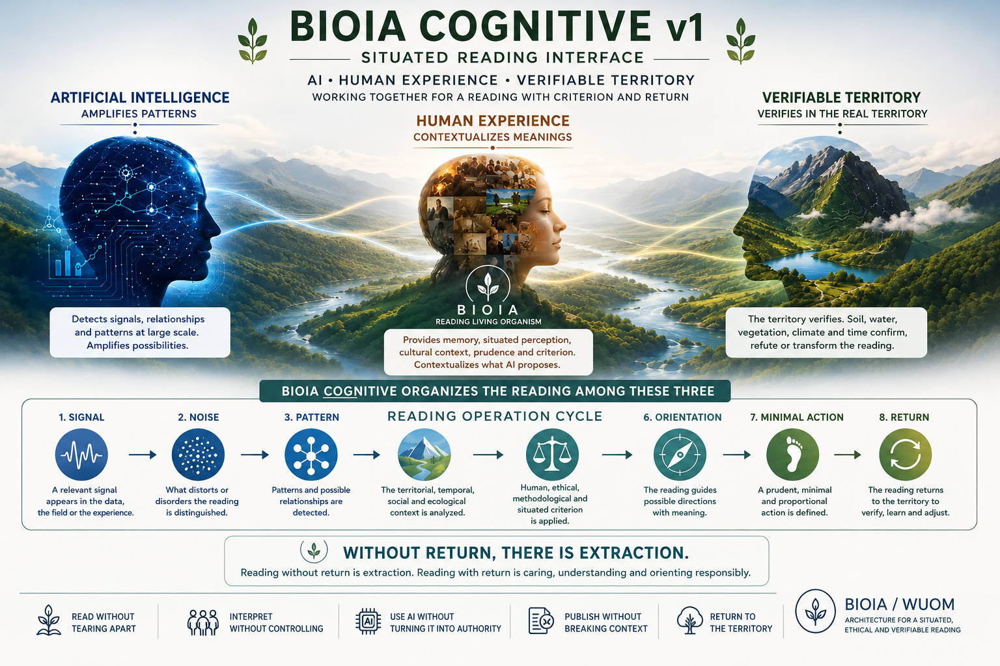

# BIOIA Cognitive v1

**Situated reading interface · AI · human experience · verifiable territory · criterion · return**

---

## What is BIOIA Cognitive v1?

**BIOIA Cognitive v1 defines how BIOIA reads.**

It does not read the mind.
It reads the conditions of reading.

AI amplifies.
Human experience contextualizes.
The territory verifies.
BIOIA Cognitive organizes the reading between the three.

BIOIA Cognitive v1 is a **situated reading interface**.

Its function is to organize the relationship between artificial intelligence, human experience and verifiable territory in order to distinguish:

* signal
* noise
* pattern
* context
* criterion
* orientation
* minimal action
* return

It is not clinical psychology.
It is not mind-reading.
It is not an autonomous AI.
It is not a magical tool.
It is not a surveillance or control system.

---

## Core Principle

> **Without return, there is extraction.**

A reading becomes extractive when it takes information from a territory, a community, an experience or a situation and turns it into data, narrative, product, prediction or decision without returning context, care, traceability or consequence.

BIOIA Cognitive v1 proposes another direction:

* read without tearing from context
* interpret without controlling
* use AI without turning it into authority
* orient without replacing responsibility
* publish without breaking context
* return to the territory when the reading requires it

---

## The Triad

| Element                 | Function       |
| ----------------------- | -------------- |
| Artificial Intelligence | amplifies      |
| Human Experience        | contextualizes |
| Verifiable Territory    | verifies       |

BIOIA Cognitive v1 does not replace any of these elements.

It puts them in relation.

---

## Relationship with BIOIA Territorial

BIOIA Territorial reads the field.

BIOIA Cognitive reads the reading of the field.

Return verifies both.

The territorial interface asks:

> **What is happening in the territory?**

The cognitive interface asks:

> **How are we reading what is happening?**

This double reading helps avoid two errors:

1. reading the territory without reviewing how it is being interpreted;
2. producing interpretation without returning to the territory.

---

## Operational Reading Cycle

The operational cycle of BIOIA Cognitive v1 is:

1. **Signal**
   Something relevant appears in the data, the field or the experience.

2. **Noise**
   What may distort or disorder the reading is distinguished.

3. **Pattern**
   Possible relationships or recurrences between elements are detected.

4. **Context**
   The territorial, temporal, social and ecological context is analyzed.

5. **Criterion**
   Human, ethical, methodological and situated criterion is applied.

6. **Orientation**
   The reading guides possible directions with meaning.

7. **Minimal Action**
   A prudent, minimal and proportional action is defined.

8. **Return**
   The reading returns to the territory in order to verify, correct and learn.

This cycle is not a closed line.

It is a breathing process of reading.

---

## Public Policy and Governance

BIOIA Cognitive v1 can also be useful in the field of **public policy and governance**.

Not as a propaganda tool.
Not as a profiling system.
Not as a mechanism of social control.
Not as an AI system replacing democratic deliberation.

Its function is different:

> **to help read more clearly the conditions of a public decision before acting.**

It can help distinguish:

* data and interpretation
* signal and noise
* pattern and context
* narrative and verification
* orientation and decision
* intervention and return
* participation and extraction

BIOIA Cognitive v1 does not decide politically.

It helps review the conditions of reading before a public decision becomes action.

> **It does not replace democratic deliberation.
> It can improve the reading prior to a public decision.**

---

## Key Formulas

**BIOIA Cognitive v1 defines how BIOIA reads.**

**BIOIA Cognitive does not read the mind.
It reads the conditions of reading.**

**AI amplifies.
Human experience contextualizes.
The territory verifies.
BIOIA Cognitive organizes the reading between the three.**

**The territorial interface reads the field.
The cognitive interface reads the reading of the field.
Return verifies both.**

**A signal is not yet a truth.**

**A pattern without context must not become orientation.**

**Data without context must not become decision.**

**A reading without traceability must not become authority.**

**Without return, there is extraction.**

---

## Public Pages

- [CAT — BIOIA Cognitiva v1](https://fuschia-wineberry-c88.notion.site/BIOIA-Cognitiva-v1-CAT-38601379e35c80c8a125d1283501caff?pvs=143)
- [ES — BIOIA Cognitiva v1](https://fuschia-wineberry-c88.notion.site/BIOIA-Cognitiva-v1-ES-38601379e35c80f29462cb006314c6a5?pvs=143)
- [EN — BIOIA Cognitive v1](https://fuschia-wineberry-c88.notion.site/BIOIA-Cognitive-v1-EN-38601379e35c804d8951d39dfd709724?pvs=143)

---

## Use Criteria

This public material may be read, shared and referenced as a situated reading framework.

Do not use BIOIA Cognitive v1 for:

* surveillance
* profiling
* manipulation
* propaganda
* mind-reading claims
* clinical diagnosis
* extraction without return
* replacing democratic deliberation
* turning AI output into authority

---

## BIOIA / WUOM

BIOIA Cognitive v1 belongs to the BIOIA / WUOM ecosystem.

WUOM organizes the logic of relation.
BIOIA embodies that logic as a situated reading organism.

BIOIA Territorial reads the field.
BIOIA Cognitive reads the reading of the field.
Return verifies both.

## links

- [LinkedIn](www.linkedin.com/in/alé-robles-rionegro)
- [Carrd](www.wuom.carrd.co)
  
**Without return, there is extraction.**
